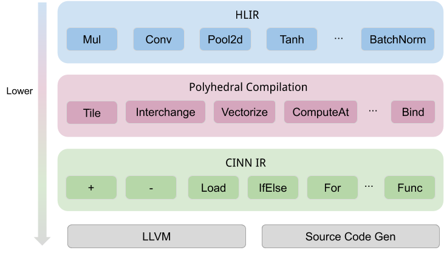

```
                        ___                    ___          ___     
                       /\__\                  /\  \        /\  \    ______________
                      /:/  /       ___        \:\  \       \:\  \   
                     /:/  /       /\__\        \:\  \       \:\  \  ______________
                    /:/  /  ___  /:/__/    _____\:\  \  _____\:\  \ 
                   /:/__/  /\__\/::\  \   /::::::::\__\/::::::::\__\ ______________
                   \:\  \ /:/  /\/\:\  \__\:\~~\~~\/__/\:\~~\~~\/__/
                    \:\  /:/  /  ~~\:\/\__\\:\  \       \:\  \       _________________
                     \:\/:/  /      \::/  / \:\  \       \:\  \     ______________
                      \::/  /       /:/  /   \:\__\       \:\__\    ______________
                       \/__/        \/__/     \/__/        \/__/    ______________

```


# CINN : Compiler Infrastructure for Neural Networks

The project CINN is a machine learning compiler and executor for multiple hardware. 
It is designed to provide multiple layers of APIs to make DNN computation graph easier to define,  faster to execute, and more convenient to extend with more hardware backends. Currently, it targets X86 CPUs and NVidia GPUs, and it is easy to extend.

This project is in active development. 

## Example

Let's take C++ APIs as an example, the corresponding Python APIs are available and just differ little.

### Load a PaddlePaddle model and execute

```c++
#include "cinn/frontend/executor.h"
using cinn::hlir::framework;

Executor executor({"input0"}/*list of inputs' names*/, 
                  {{1, 30}}/*list of inputs' shapes*/);
executor.LoadPaddleModel(/*string of model directory*/);
auto input_handle = executor.GetTensor("input0");
auto output_handle = executor.GetTensor("output0");
// set data to input_handle
executor.Run();
// get output content from output_handle
```

### Define a raw computation and execute

The following is a naive matrix-multiplication implementation

```c++
#include "cinn/cinn.h"
using namespace cinn;

Expr M(10), N(20), K(30);
Placeholder<float> A("A", {M, K});
Placeholder<float> B("B", {K, N});
// reduce axis
Var k(K.as_int32(), "k");

auto C = Compute({M, N},
                 [=](Expr i, Expr j) { return Sum(A(i, k) * B(k, j), {k}/*reduce axis*/); }, 
                 "C");

auto stages = CreateStages({C});

// some schedule to optimize the code
stages[C]->Tile(0, 1, 4, 4); // Tile the 0-th and 1-th axis with the block size as 4.
```

## How it works

CINN lowers a traditional neural network model into a two-level intermediate representation(IR). The high-level IR(HLIR) helps to define some domain-specific computation and perform some overall optimization on the IR-graph; 
the lower-level IR(CINN IR) helps to represent some computation semantic and finally lower to a hardware backend.

CINN is based on the polyhedral compilation thus it is easy to extend with more loop optimizations.
The schedule transform is applied between the lowering from HLIR to CINN IR.

The overall architecture is as follows




##  Getting Started

### Compile and execute the code
To compile the CINN's code, one need to build the docker image first

```sh
cd tools/docker
ln -s Dockerfile.cpu Dockerfile
docker build . -t cinn-dev
```

Then start a docker container, and compile the code inside it

```sh
# inside the docker container

# compile and install isl
sh tools/ci_build.sh

# compile the tests and python library
./build.sh ci
```

After compilation, you can launch the C++ and python tests
```sh
cd build
ctest -V
```

### Concepts
There are two levels of APIs in CINN, the higher level is HLIR and the lower level is CINN IR, both contain some concepts.

In HLIR

- `Primitive Emitter`(PE), encapsulates the computation of different tensor-based algorithms,
- `frontend::Executor`, the container to execute a model (of PaddlePaddle),
- `frotnend::Program`, the program helps to define a machine learning computation,
- `hlir::framework::Tensor`, multi-dimensional arrays helps to manage a memory buffer.

In CINN IR

- `Compute`, the method to define a computation,
- `Lower`, the method to lower a computation to the corresponding IR,
- `LoweredFunc`, the function defined in CINN IR,
- `Var`, a scalar variable,
- `Expr`, an expression represents any CINN IR node(no specified Statement node),
- `Stage`, holds some schedule details of a tensor,

### Reference the API usage
Read the code in the tests

For Python API, reference the code inside `python/tests`.

The C++ API locates in `cinn/*/*_test.cc`, the high level API locates in `hlir/frontend`, the lower level API is in `cinn/cinn.h`.

## License

CINN is licensed under the Apache 2.0 License.
